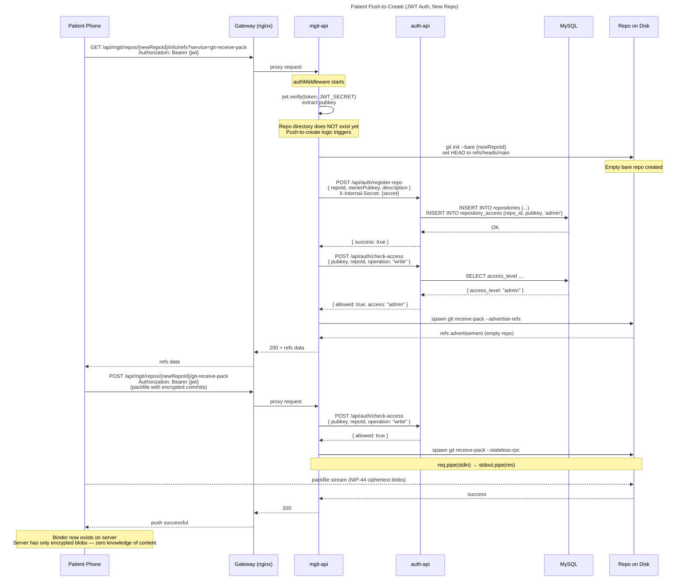
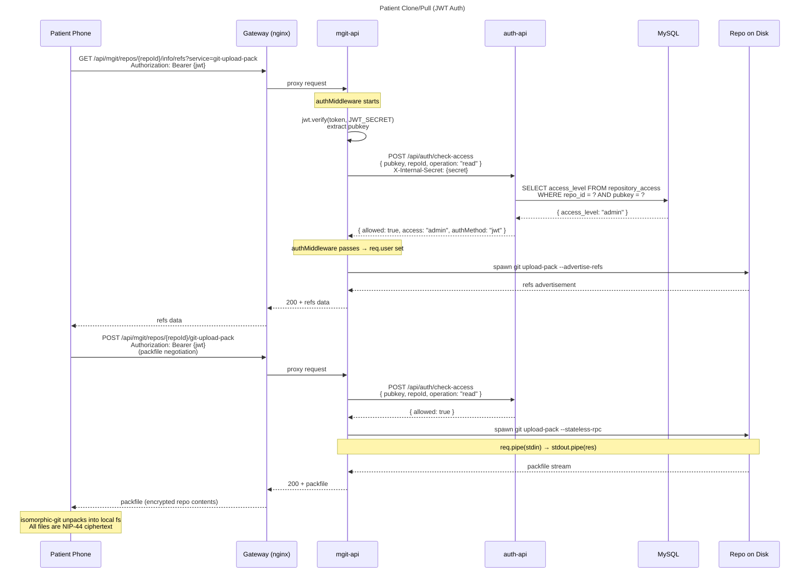
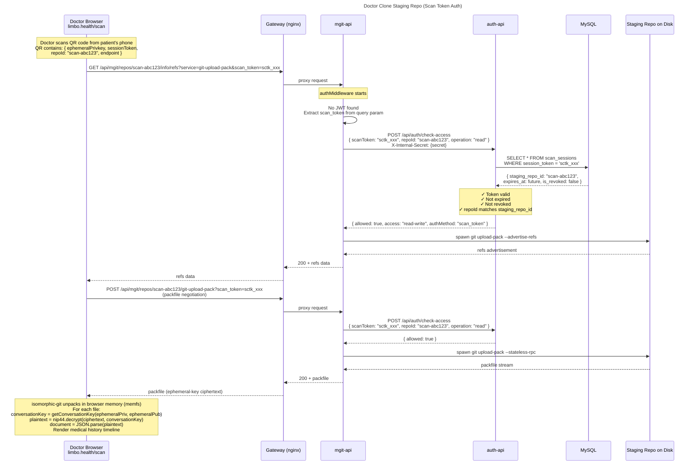
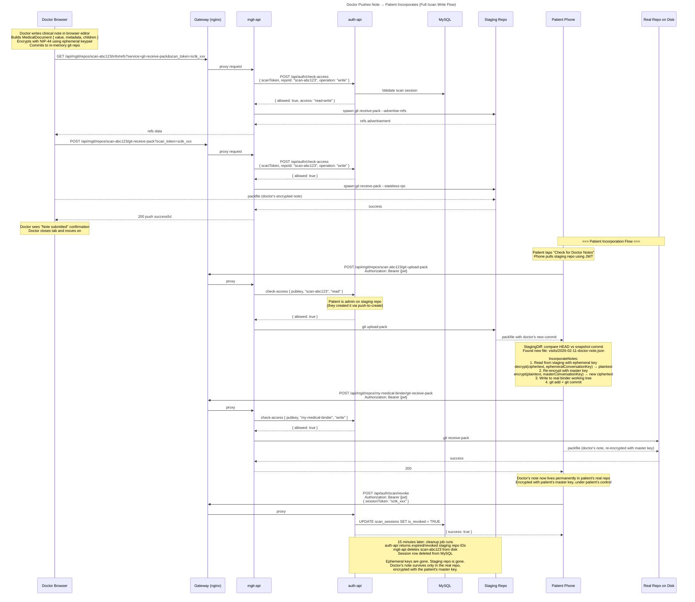

# Patient Push to Create

```mermaid
sequenceDiagram
    title Patient Push-to-Create (JWT Auth, New Repo)

    participant Phone as Patient Phone
    participant GW as Gateway (nginx)
    participant MGit as mgit-api
    participant Auth as auth-api
    participant MySQL as MySQL
    participant Disk as Repo on Disk

    Phone->>GW: GET /api/mgit/repos/{newRepoId}/info/refs?service=git-receive-pack<br/>Authorization: Bearer {jwt}
    GW->>MGit: proxy request
    Note over MGit: authMiddleware starts
    MGit->>MGit: jwt.verify(token, JWT_SECRET)<br/>extract pubkey

    Note over MGit: Repo directory does NOT exist yet<br/>Push-to-create logic triggers

    MGit->>Disk: git init --bare {newRepoId}<br/>set HEAD to refs/heads/main
    Note over Disk: Empty bare repo created

    MGit->>Auth: POST /api/auth/register-repo<br/>{ repoId, ownerPubkey, description }<br/>X-Internal-Secret: {secret}
    Auth->>MySQL: INSERT INTO repositories (...)<br/>INSERT INTO repository_access (repo_id, pubkey, 'admin')
    MySQL-->>Auth: OK
    Auth-->>MGit: { success: true }

    MGit->>Auth: POST /api/auth/check-access<br/>{ pubkey, repoId, operation: "write" }
    Auth->>MySQL: SELECT access_level ...
    MySQL-->>Auth: { access_level: "admin" }
    Auth-->>MGit: { allowed: true, access: "admin" }

    MGit->>Disk: spawn git receive-pack --advertise-refs
    Disk-->>MGit: refs advertisement (empty repo)
    MGit-->>GW: 200 + refs data
    GW-->>Phone: refs data

    Phone->>GW: POST /api/mgit/repos/{newRepoId}/git-receive-pack<br/>Authorization: Bearer {jwt}<br/>(packfile with encrypted commits)
    GW->>MGit: proxy request
    MGit->>Auth: POST /api/auth/check-access<br/>{ pubkey, repoId, operation: "write" }
    Auth-->>MGit: { allowed: true }
    MGit->>Disk: spawn git receive-pack --stateless-rpc
    Note over MGit,Disk: req.pipe(stdin) → stdout.pipe(res)
    Phone-->>Disk: packfile stream (NIP-44 ciphertext blobs)
    Disk-->>MGit: success
    MGit-->>GW: 200
    GW-->>Phone: push successful
    Note over Phone: Binder now exists on server<br/>Server has only encrypted blobs — zero knowledge of content
```

# Patient Clone

```mermaid
sequenceDiagram
    title Patient Clone/Pull (JWT Auth)

    participant Phone as Patient Phone
    participant GW as Gateway (nginx)
    participant MGit as mgit-api
    participant Auth as auth-api
    participant MySQL as MySQL
    participant Disk as Repo on Disk

    Phone->>GW: GET /api/mgit/repos/{repoId}/info/refs?service=git-upload-pack<br/>Authorization: Bearer {jwt}
    GW->>MGit: proxy request
    Note over MGit: authMiddleware starts
    MGit->>MGit: jwt.verify(token, JWT_SECRET)<br/>extract pubkey
    MGit->>Auth: POST /api/auth/check-access<br/>{ pubkey, repoId, operation: "read" }<br/>X-Internal-Secret: {secret}
    Auth->>MySQL: SELECT access_level FROM repository_access<br/>WHERE repo_id = ? AND pubkey = ?
    MySQL-->>Auth: { access_level: "admin" }
    Auth-->>MGit: { allowed: true, access: "admin", authMethod: "jwt" }
    Note over MGit: authMiddleware passes → req.user set
    MGit->>Disk: spawn git upload-pack --advertise-refs
    Disk-->>MGit: refs advertisement
    MGit-->>GW: 200 + refs data
    GW-->>Phone: refs data

    Phone->>GW: POST /api/mgit/repos/{repoId}/git-upload-pack<br/>Authorization: Bearer {jwt}<br/>(packfile negotiation)
    GW->>MGit: proxy request
    MGit->>Auth: POST /api/auth/check-access<br/>{ pubkey, repoId, operation: "read" }
    Auth-->>MGit: { allowed: true }
    MGit->>Disk: spawn git upload-pack --stateless-rpc
    Note over MGit,Disk: req.pipe(stdin) → stdout.pipe(res)
    Disk-->>MGit: packfile stream
    MGit-->>GW: 200 + packfile
    GW-->>Phone: packfile (encrypted repo contents)
    Note over Phone: isomorphic-git unpacks into local fs<br/>All files are NIP-44 ciphertext
```

# Doctor Clone

```mermaid
sequenceDiagram
    title Doctor Clone Staging Repo (Scan Token Auth)

    participant Doc as Doctor Browser<br/>limbo.health/scan
    participant GW as Gateway (nginx)
    participant MGit as mgit-api
    participant Auth as auth-api
    participant MySQL as MySQL
    participant Disk as Staging Repo on Disk

    Note over Doc: Doctor scans QR code from patient's phone<br/>QR contains: { ephemeralPrivkey, sessionToken,<br/>repoId: "scan-abc123", endpoint }

    Doc->>GW: GET /api/mgit/repos/scan-abc123/info/refs?service=git-upload-pack&scan_token=sctk_xxx
    GW->>MGit: proxy request
    Note over MGit: authMiddleware starts
    MGit->>MGit: No JWT found<br/>Extract scan_token from query param

    MGit->>Auth: POST /api/auth/check-access<br/>{ scanToken: "sctk_xxx", repoId: "scan-abc123", operation: "read" }<br/>X-Internal-Secret: {secret}
    Auth->>MySQL: SELECT * FROM scan_sessions<br/>WHERE session_token = 'sctk_xxx'
    MySQL-->>Auth: { staging_repo_id: "scan-abc123",<br/>expires_at: future, is_revoked: false }
    Note over Auth: ✓ Token valid<br/>✓ Not expired<br/>✓ Not revoked<br/>✓ repoId matches staging_repo_id
    Auth-->>MGit: { allowed: true, access: "read-write", authMethod: "scan_token" }

    MGit->>Disk: spawn git upload-pack --advertise-refs
    Disk-->>MGit: refs advertisement
    MGit-->>GW: 200 + refs data
    GW-->>Doc: refs data

    Doc->>GW: POST /api/mgit/repos/scan-abc123/git-upload-pack?scan_token=sctk_xxx<br/>(packfile negotiation)
    GW->>MGit: proxy request
    MGit->>Auth: POST /api/auth/check-access<br/>{ scanToken: "sctk_xxx", repoId: "scan-abc123", operation: "read" }
    Auth-->>MGit: { allowed: true }
    MGit->>Disk: spawn git upload-pack --stateless-rpc
    Disk-->>MGit: packfile stream
    MGit-->>GW: 200 + packfile
    GW-->>Doc: packfile (ephemeral-key ciphertext)

    Note over Doc: isomorphic-git unpacks in browser memory (memfs)<br/>For each file:<br/>  conversationKey = getConversationKey(ephemeralPriv, ephemeralPub)<br/>  plaintext = nip44.decrypt(ciphertext, conversationKey)<br/>  document = JSON.parse(plaintext)<br/>Render medical history timeline
```

# Doctor Push Incorporate

```mermaid
sequenceDiagram
    title Doctor Pushes Note → Patient Incorporates (Full /scan Write Flow)

    participant Doc as Doctor Browser
    participant GW as Gateway (nginx)
    participant MGit as mgit-api
    participant Auth as auth-api
    participant MySQL as MySQL
    participant Disk as Staging Repo
    participant Phone as Patient Phone
    participant Real as Real Repo on Disk

    Note over Doc: Doctor writes clinical note in browser editor<br/>Builds MedicalDocument { value, metadata, children }<br/>Encrypts with NIP-44 using ephemeral keypair<br/>Commits to in-memory git repo

    Doc->>GW: GET /api/mgit/repos/scan-abc123/info/refs?service=git-receive-pack&scan_token=sctk_xxx
    GW->>MGit: proxy request
    MGit->>Auth: POST /api/auth/check-access<br/>{ scanToken, repoId: "scan-abc123", operation: "write" }
    Auth->>MySQL: Validate scan session
    Auth-->>MGit: { allowed: true, access: "read-write" }
    MGit->>Disk: spawn git receive-pack --advertise-refs
    Disk-->>MGit: refs advertisement
    MGit-->>Doc: refs data

    Doc->>GW: POST /api/mgit/repos/scan-abc123/git-receive-pack?scan_token=sctk_xxx
    GW->>MGit: proxy request
    MGit->>Auth: POST /api/auth/check-access<br/>{ scanToken, repoId: "scan-abc123", operation: "write" }
    Auth-->>MGit: { allowed: true }
    MGit->>Disk: spawn git receive-pack --stateless-rpc
    Doc-->>Disk: packfile (doctor's encrypted note)
    Disk-->>MGit: success
    MGit-->>Doc: 200 push successful

    Note over Doc: Doctor sees "Note submitted" confirmation<br/>Doctor closes tab and moves on

    Note over Phone,Real: === Patient Incorporation Flow ===

    Note over Phone: Patient taps "Check for Doctor Notes"<br/>Phone pulls staging repo using JWT

    Phone->>GW: POST /api/mgit/repos/scan-abc123/git-upload-pack<br/>Authorization: Bearer {jwt}
    GW->>MGit: proxy
    MGit->>Auth: check-access { pubkey, "scan-abc123", "read" }
    Note over Auth: Patient is admin on staging repo<br/>(they created it via push-to-create)
    Auth-->>MGit: { allowed: true }
    MGit->>Disk: git upload-pack
    Disk-->>Phone: packfile with doctor's new commit

    Note over Phone: StagingDiff: compare HEAD vs snapshot commit<br/>Found new file: visits/2026-02-11-doctor-note.json<br/><br/>IncorporateNotes:<br/>  1. Read from staging with ephemeral key<br/>     decrypt(ciphertext, ephemeralConversationKey) → plaintext<br/>  2. Re-encrypt with master key<br/>     encrypt(plaintext, masterConversationKey) → new ciphertext<br/>  3. Write to real binder working tree<br/>  4. git add + git commit

    Phone->>GW: POST /api/mgit/repos/my-medical-binder/git-receive-pack<br/>Authorization: Bearer {jwt}
    GW->>MGit: proxy
    MGit->>Auth: check-access { pubkey, "my-medical-binder", "write" }
    Auth-->>MGit: { allowed: true }
    MGit->>Real: git receive-pack
    Phone-->>Real: packfile (doctor's note, re-encrypted with master key)
    Real-->>MGit: success
    MGit-->>Phone: 200

    Note over Phone: Doctor's note now lives permanently in patient's real repo<br/>Encrypted with patient's master key, under patient's control

    Phone->>GW: POST /api/auth/scan/revoke<br/>Authorization: Bearer {jwt}<br/>{ sessionToken: "sctk_xxx" }
    GW->>Auth: proxy
    Auth->>MySQL: UPDATE scan_sessions SET is_revoked = TRUE
    Auth-->>Phone: { success: true }

    Note over Auth,Disk: 15 minutes later: cleanup job runs<br/>auth-api returns expired/revoked staging repo IDs<br/>mgit-api deletes scan-abc123 from disk<br/>Session row deleted from MySQL<br/><br/>Ephemeral keys are gone. Staging repo is gone.<br/>Doctor's note survives only in the real repo,<br/>encrypted with the patient's master key.
```